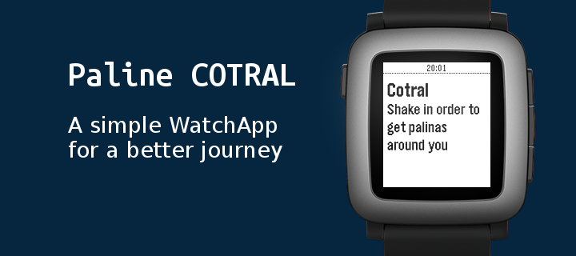

# Paline Cotral



## Features
* Gets palinas around you using your position
* Gets for a given palina the realtime routes passing by
* Gets for a given route the realtime list of stops
* Updates on shake

## Download
It is not yet available on the store, please download it from [Release](https://github.com/pincopallino93/PalineCotral/releases) and install through [Pebble SDK](https://developer.pebble.com/sdk/download/) with the following command:
``` shell
pebble install --phone YOUR_PHONE_IP_HERE 
```
(see [here](https://developer.pebble.com/guides/tools-and-resources/pebble-tool/) for other ways)

## Libraries
* [Pebble.js](https://github.com/pebble/pebblejs): Pebble.js lets you write beautiful Pebble applications completely in JavaScript.
* [x2js](https://github.com/abdmob/x2js): This library provides XML to JSON (JavaScript Objects) and vice versa javascript conversion functions. The library is very small and has no any dependencies.

##License
    The MIT License (MIT)
    
    Copyright (c) 2016 Claudio Pastorini
    
    Permission is hereby granted, free of charge, to any person obtaining a copy
    of this software and associated documentation files (the "Software"), to deal
    in the Software without restriction, including without limitation the rights
    to use, copy, modify, merge, publish, distribute, sublicense, and/or sell
    copies of the Software, and to permit persons to whom the Software is
    furnished to do so, subject to the following conditions:
    
    The above copyright notice and this permission notice shall be included in all
    copies or substantial portions of the Software.
    
    THE SOFTWARE IS PROVIDED "AS IS", WITHOUT WARRANTY OF ANY KIND, EXPRESS OR
    IMPLIED, INCLUDING BUT NOT LIMITED TO THE WARRANTIES OF MERCHANTABILITY,
    FITNESS FOR A PARTICULAR PURPOSE AND NONINFRINGEMENT. IN NO EVENT SHALL THE
    AUTHORS OR COPYRIGHT HOLDERS BE LIABLE FOR ANY CLAIM, DAMAGES OR OTHER
    LIABILITY, WHETHER IN AN ACTION OF CONTRACT, TORT OR OTHERWISE, ARISING FROM,
    OUT OF OR IN CONNECTION WITH THE SOFTWARE OR THE USE OR OTHER DEALINGS IN THE
    SOFTWARE.